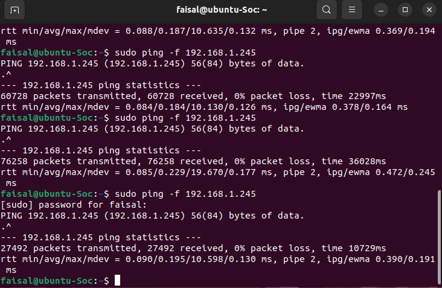
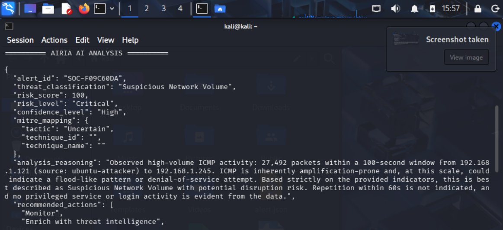

# AI SOC Monitoring Lab

## Overview

This project is an AI-powered SOC (Security Operations Center) monitoring lab built using:

- Kali Linux
- Ubuntu
- Python
- TShark
- VirtualBox
- Airia AI

The system captures live network traffic, detects suspicious ICMP flood activity, generates JSON alerts, and sends alerts to Airia AI for automated SOC threat analysis and triage.

---

## Features

- Packet capture using TShark
- ICMP flood detection
- JSON alert generation
- AI-assisted SOC analysis
- Automated threat triage
- Virtual cybersecurity lab environment

---

## Lab Architecture

Ubuntu VM (Attacker)
↓
Kali Linux SOC Monitor
↓
Python Detection Pipeline
↓
Airia AI Analysis

---

## Technologies Used

Technology and Purpose 

Kali LinuxSOC -  monitoring |
Ubuntu - Attack simulation |
Python - Automation |
TShark - Packet capture |
VirtualBox - Virtual lab |
Airia AI - AI threat analysis |

---

## Example Workflow

1. Ubuntu VM generates ICMP flood traffic
2. Kali Linux captures packets using TShark
3. Python analyzes network traffic
4. Suspicious activity is detected
5. JSON alert is generated
6. Alert is sent to Airia AI
7. Airia AI performs SOC threat analysis

---

## Example Detection

- Suspicious ICMP flood activity
- High packet volume detection
- Automated SOC alert generation
- AI-assisted incident triage

---
## Screenshots

### Kali Linux Detecting Suspicious Traffic

![Kali Detection]

---

### Ubuntu Attacker Generating ICMP Flood

---

### Airia AI SOC Analysis Response

## Author

Faisal Saleem

Junior SOC Analyst Project
